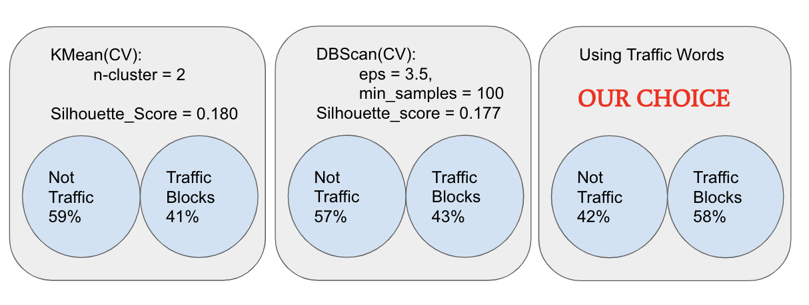
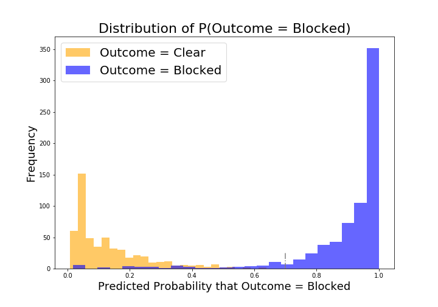
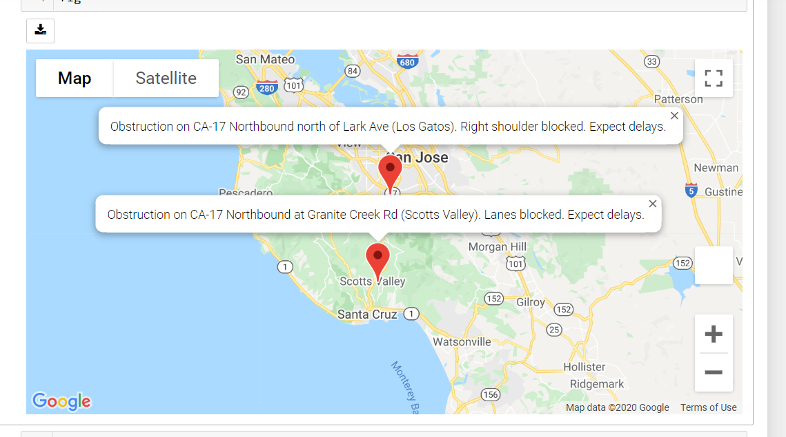

# Is your family prepared to escape the natural disasters?

---

### Problem Statement
During emergencies and disasters, we want to provide users with real time information that can aid in their evacuation and/or reduce time required to reach their desired destination.
Time and efficiency is of the essence when people’s lives are on the line!

---

### Executive Summary
Using a model, we will be building an app that collects Twitter posts from within the user's search area.  The app will collect all posts within our designated radius in miles of the selected city and classify them as "blocked road" news or "clear road" news with our best machine learning model. The coordinates will then be extracted and placed on Google maps for our users to see.  The power of this app, unlike Waze and Google maps, is that we'll be crowd sourcing all of our live information from citizens along with respectable and traffic dedicated Twitter accounts.  With this app, we hope to provide all citizens with the power of crowdsourced news at the tip of their fingers when it really counts.

---

### Methodology
* Step 1: Data Collection: We searched extensively through online sources to collect a list of reputable traffic news sources.  Using GetOldTweets3, we searched and collected the most recent 5000 posts. Based on our understanding of traffic news and natural disasters, we know that traffic reports of road blocks and such will be reported as a road block, for example. Searching for road blocks and closure is inclusive of all disaster-caused road blocks and closures.

Based on our problem at hand, we opted to find and use twitter accounts dedicated to traffic information as our training data.  We wanted to start off with and built a model from our training data and then include twitter posts from all users that meet our search criteria to ensure a proper collection of tweets.  The reason we chose KCBSAMFMTraffic is because of their traffic dedicated agenda. While there’s still a good amount of noise within the list of tweets, it is evident that a majority of their posts are geared towards providing commuters real time updates of our popular commute routes.

* Step 2: Exploratory Data Analysis: We started off with KMeans and DBSCAN clustering to see what results we could derive just from clustering techniques. We then compared it with manual key words filtering.

We opted to go with our manual key words filtering so that we can focus on true positives.

* Step 3: Model Selection: After spot checking our newly labeled Twitter posts, we will run our data through a series of models. Based on our models' performance, we'll select the best performer and move onto the next step with our chosen model. 

Below is our Logistic Regression plot.

* Step 4: Location extraction and display: Using our model, we then use the Google API to extract the longitude and latitude of the impacted areas and map them onto an interactive map for our users to view.

Below is an example of an output.

---

### Findings

|                         | Training Score | Testing Score | Sensitivity |
|-------------------------|----------------|---------------|-------------|
| Logistic Regression(CV) | .971           | .970          | .972        |
| Logisitc Regression(TV) | .955           | .965          | .969        |
| Random Forest           | .973           | .978          | .972        |
| Multinomial Naive Bayes | .904           | .866          | .990        |
| Gaussian Naive Bayes    | .936           | .770          | .866        |
| K Nearest Neighbors     | .881           | .869          | .933        |
| Support Vector Machines | .974           | .976          | .969        |

Based on our spot checked results, we believe that logistic regression is the best model for us to move forward with. Despite similar accuracy scores amongst other models, we believe that using logistic regression will provide us the most insight with each tweet’s probability and their words’ coefficients.

---

### Next Steps

* Further explore clustering
* Funding for google api to provide service over larger areas
* Funding for AWS to compute all calculations and to provide quick response times for users
* Word2Vec implementation for a more complex natural language processing to help with our model’s classification
* Best route continuation using google map developer platform (distance matrix and direction) as well as here.com developer platform
* Collecting more twitter accounts to map the entire USA and possible other social media sources

